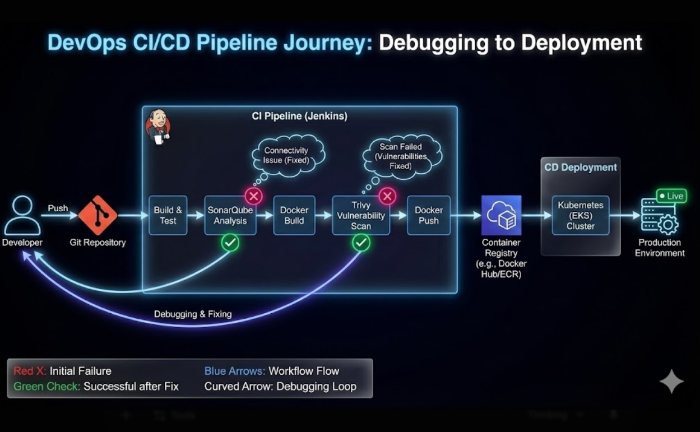

---
## 🚀 CI/CD Pipeline Architecture
This project utilizes a **GitOps** approach for automated deployment. Below is the architectural flow used to deploy the application from development to the EKS production cluster.

### 🛠️ Tech Stack
* **Version Control:** GitHub
* **CI Server:** Jenkins
* **Build Tool:** Maven
* **Code Quality:** SonarQube
* **Containerization:** Docker & Docker Hub
* **Security:** Trivy (Image Scanning)
* **CD / GitOps:** Argo CD
* **Orchestration:** Amazon EKS (Kubernetes)
* **Notifications:** Slack

### 🔄 Workflow Description
1.  **Code Push:** Developer pushes code to the Application Repo.
2.  **CI Trigger:** Jenkins detects changes and triggers the build.
3.  **Build & Test:** Maven compiles the code and runs unit tests.
4.  **Analysis:** SonarQube performs static code analysis.
5.  **Dockerize:** Jenkins builds the Docker image and pushes it to Docker Hub.
6.  **Security Scan:** Trivy scans the Docker image for vulnerabilities.
7.  **Update Manifest:** The CI pipeline updates the Kubernetes manifest repository with the new build tag.
8.  **Sync:** Argo CD detects the change in the manifest repo.
9.  **Deploy:** Argo CD synchronizes the state and deploys to the EKS Cluster.
10. **Notify:** A notification is sent to Slack regarding the deployment status.
